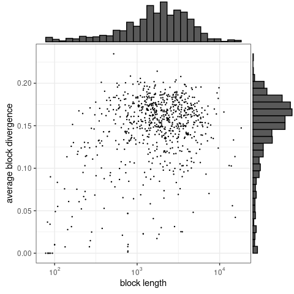

segmut
================
2022-12-12

<!-- README.md is generated from README.Rmd. Please edit that file -->

# Package description

<!-- badges: start -->
<!-- badges: end -->

The goal of segmut is to segment genome with mutations to segments with
significantly different mutations density.

## Installation

You can install the development version of segmut from
[GitHub](https://github.com/) with:

``` r
# detach("package:segmut", unload=TRUE)
# install.packages("devtools")
# Sys.unsetenv("GITHUB_PAT")
# install.packages("/home/misha/Documents/Development/segmut/", repos = NULL, type = "source",force=TRUE)
devtools::install_github("mishashe/segmut")
```

To load nessesary libraries:

``` r
library(segmut)
library(DEoptim, quietly=T) # to find optimal break points using differential evolution algorithm
#> 
#> DEoptim package
#> Differential Evolution algorithm in R
#> Authors: D. Ardia, K. Mullen, B. Peterson and J. Ulrich
library(RColorBrewer, quietly=T) # to plot results
library(stringr)
library(tidyverse)
#> ── Attaching packages
#> ───────────────────────────────────────
#> tidyverse 1.3.2 ──
#> ✔ ggplot2 3.4.0      ✔ purrr   0.3.5 
#> ✔ tibble  3.1.8      ✔ dplyr   1.0.10
#> ✔ tidyr   1.2.1      ✔ forcats 0.5.2 
#> ✔ readr   2.1.3      
#> ── Conflicts ────────────────────────────────────────── tidyverse_conflicts() ──
#> ✖ dplyr::filter() masks stats::filter()
#> ✖ dplyr::lag()    masks stats::lag()
library(scales)
#> 
#> Attaching package: 'scales'
#> 
#> The following object is masked from 'package:purrr':
#> 
#>     discard
#> 
#> The following object is masked from 'package:readr':
#> 
#>     col_factor
library(ggExtra)
library(stringi)
```

To set parameters

``` r
Kmin <- 20
```

To generate example of genome of length `L` with vector of mutation
locations `muts`:

``` r
L <- 4000
muts <- sort(c(sample(1:700,700*0.1),
               sample(701:2000,2300*0.2),
               sample(2001:3200,1200*0.15),
               sample(3201:4000,800*0.08)))
```

## Example with known number of breaks `n=3`

This is a basic example which shows you how to find positions of `n=3`
breaks:

To find optimal breaks locations given `n=3` number of breaks

``` r
res <- getBreaksChiSquare(muts = muts, L = L, Kmin=Kmin, n=3)
```

To plot the results

``` r
breaks0L <- sort(c(0,res$optim$bestmem,L))
colors <- brewer.pal(name="Paired", n=length(breaks0L)-1)
par(mar=c(2,0,0,0))
plot(muts,rep(0,length(muts)),pch=".", cex = 1.5,ylim=c(-0.06,0.01),ylab="",xlab="", axes=F)
axis(side=1, at=c(0,700,2000,3200,L))
for (i in 1:(length(breaks0L)-1))
{
  lines(c(breaks0L[i],breaks0L[i+1]),c(-0.05,-0.05),col=colors[i], lwd=5)
}
```


## Example with unknown number of breaks

This is a basic example which shows you how to find optimal number of
breaks and their locations:

To find optimal number of breaks

``` r
breaks <- getNumberBreaksChiSquare(muts,L=L,Kmin=Kmin)
```

To plot the results

``` r
breaks0L <- sort(c(0,breaks,L))
colors <- brewer.pal(name="Paired", n=length(breaks0L)-1)
par(mar=c(2,0,0,0))
plot(muts,rep(0,length(muts)),pch=".", cex = 1.5,ylim=c(-0.06,0.01),ylab="",xlab="", axes=F)
axis(side=1, at=c(0,700,2000,3200,L))
for (i in 1:(length(breaks0L)-1))
{
  lines(c(breaks0L[i],breaks0L[i+1]),c(-0.05,-0.05),col=colors[i], lwd=5)
}
```


## Example with Escherichia coli (NZ_CP033020.1) vs. Salmonella enterica (NZ_AP026948) alignment

We align two bacterial genomes using nucmer and get all the alignment
blocks and the mutations

``` r
datadir <- "/home/misha/Documents/Development/segmut/data/"
file1 <- paste0(datadir,"Escherichia_coli_1.fasta")
file2 <- paste0(datadir,"Salmonella_enterica_1.fasta")
system(paste0("nucmer --mum --prefix=",datadir,"align ",file1," ",file2), intern = TRUE, wait=TRUE)
#> character(0)
alignment <- system(paste0("show-aligns -w 500000 ", datadir,"align.delta NZ_CP033020.1 NZ_AP026948.1"), intern = TRUE, wait=TRUE)
alignment <- alignment[str_detect(alignment,"\\^")]
alignment <- lapply(1:length(alignment),function(i){gsub("(\\^)\\1{1,}", "\\1", alignment[[i]])}) # removing adjacent mutations
divergence <- sum(str_count(alignment,"\\^"))/sum(nchar(alignment))
block_divergences <- (str_count(alignment,"\\^"))/(nchar(alignment))
Ls <- nchar(alignment)
r <- stri_locate_all(pattern = '^', alignment, fixed = TRUE)
rs <- c()
for (i in order(-nchar(alignment))) rs <- c(rs,diff(r[[i]][,1]))
```

Plotting divergences and lengths of the alignment blocks (not segmented
ones):

``` r
p <- ggplot(data=data.frame(Ls=Ls,block_divergences=block_divergences), aes(Ls, block_divergences)) + 
          geom_point(size=0.2) +
          theme_bw() +
          scale_x_continuous(trans='log10',breaks = 10^(-10:10), labels = trans_format("log10", math_format(10^.x))) +
          # scale_y_continuous(trans='log10',breaks = 10^(-10:10), labels = trans_format("log10", math_format(10^.x))) +
          ylab("average block divergence") + xlab("block length") 
  ggExtra::ggMarginal(p, type = "histogram")
```

 In total
there are 733 blocks with the total length of 1746795 bp.

Segmenting the blocks using segmut package:

``` r
Ks <- c()
taus <- c()
start_time <- Sys.time()
for (i in order(-nchar(alignment)))
{
  L <- nchar(alignment[[i]])
  rtemp <- r[[i]][,1]
  muts <- sort(rtemp + sample(0:0,length(rtemp),replace=TRUE))
  breaks <- sort(getNumberBreaksChiSquare(muts,L=L,Kmin=Kmin))
  breaks0L <- c(0,breaks,L)
  for (j in 1:(length(breaks0L)-1))
  {
    Ks <- c(Ks, breaks0L[j+1]-breaks0L[j]+1)
    taus <- c(taus, sum(muts<breaks0L[j+1] & muts>breaks0L[j])/(breaks0L[j+1]-breaks0L[j]+1))
  }
}
end_time <- Sys.time()
print(end_time - start_time)
#> Time difference of 6.638279 mins
```

Plotting divergences and lengths of the segments:

``` r
p <- ggplot(data=data.frame(Ks=Ks,taus=taus), aes(Ks, taus)) + 
          geom_point(size=0.2) +
          theme_bw() +
          scale_x_continuous(trans='log10',breaks = 10^(-10:10), labels = trans_format("log10", math_format(10^.x))) +
          # scale_y_continuous(trans='log10',breaks = 10^(-10:10), labels = trans_format("log10", math_format(10^.x))) +
          ylab("segment divergence") + xlab("segment length") + 
          geom_smooth(method="loess",se=TRUE) 
  ggExtra::ggMarginal(p, type = "histogram")
```


Calculating empirical and pseudotheoretical MLDs:

``` r
rB <- c(seq(0.5,35.5,3),10^seq(log10(35.5)+0.1,4.8,0.1))
rV <- 0.5*(rB[-length(rB)]+rB[-1])
pH <- hist(rs,breaks=rB,plot=FALSE)

mPT <- rV*0
for (ir in 1:length(rV)) 
{
  mPT[ir] <- sum((Ks>rV[ir])*(2*taus+(Ks-rV[ir])*taus^2)*exp(-rV[ir]*taus))
}
for (iK in 1:length(Ks)) 
{
  ir <- which(Ks[iK]<=rB[2:length(rB)] & Ks[iK]>=rB[1:(length(rB)-1)])
  mPT[ir] <- mPT[ir] + exp(-taus[iK]*Ks[iK])/diff(rB)[ir]
}

mBlocks <- rV*0
for (ir in 1:length(rV)) 
{
  mBlocks[ir] <- sum((Ls>rV[ir])*(2*block_divergences+(Ls-rV[ir])*block_divergences^2)*exp(-rV[ir]*block_divergences))
}
for (iL in 1:length(Ls)) 
{
  ir <- which(Ls[iL]<=rB[2:length(rB)] & Ls[iL]>=rB[1:(length(rB)-1)])
  mBlocks[ir] <- mBlocks[ir] + exp(-block_divergences[iL]*Ls[iL])/diff(rB)[ir]
}

Ktot <- sum(Ls)
mExp <- (2*divergence+(Ktot-rV)*divergence^2)*exp(-rV*divergence)
dat <- data.frame(rV=rV,mE=pH$counts/diff(rB),mPT=mPT, mExp=mExp,mBlocks=mBlocks)
```

Plotting empirical and pseudotheoretical MLDs:

``` r
ggplot(data=dat, aes(rV, mE)) + 
          geom_line(aes(rV, mPT),col="blue", size=0.2) +
          geom_line(aes(rV, mExp),col="grey", size=0.5,linetype = "solid") +
          geom_line(aes(rV, mBlocks),col="red", size=0.2) +
          theme_bw() +
          scale_x_continuous(limits = c(1e0, 1e3),trans='log10',breaks = 10^(-10:10), labels = trans_format("log10", math_format(10^.x))) +
          scale_y_continuous(limits = c(1e-3, 1e5),trans='log10',breaks = 10^(-10:10), labels = trans_format("log10", math_format(10^.x))) +
          geom_line(aes(rV,1e8/rV^3),linetype = "dashed") + 
          geom_line(aes(rV,1e10/rV^4),linetype = "dotted") + 
          geom_point(size=2,shape='o') +
          xlab("r") + ylab("m(r)") 
```


